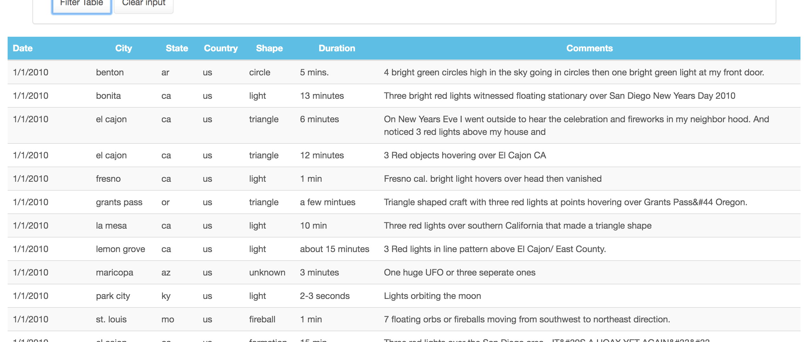

# JavaScript-and-DOM-Manipulation

In this project a basic HTML web page (index.html file) was created and integrated with a javascript file (app.js) to do the following functions:
* Append a table
* Add input options
* Filter the data according to the input data using buttons

The data used is stored in a javascript file (data.js). The table is created using this database and has the following columns: 
* date/time
* city
* state
* country
* shape
* duration
* comment

The user can filter the table with the following parameters
* date/time
* city
* state
* country
* shape

## Interface
The result is the following web page

